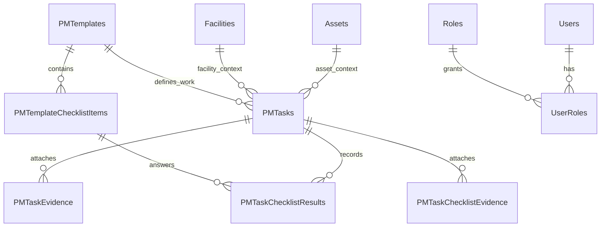

# Database Schema Specification

Last reviewed: 2026-09-10. Baseline: static inspection of [db/schema.sql](../db/schema.sql); no database connection was made for D0.

## Authority and evolution

This document owns the data-model explanation. The executable DDL is `db/schema.sql`; maintain both together. The script contains initial creation and subsequent conditional alterations, so reading only a `CREATE TABLE` block can give an incorrect final column definition. For example, `PMTasks.AssetId` is subsequently made nullable to support facilities.

The database engine is Microsoft SQL Server and the application schema is `pm`. Most entity identifiers use `uniqueidentifier`; maintenance timestamps use `datetime2`, commonly with `sysutcdatetime()` defaults. Applications must interpret stored timestamps consistently as UTC and present local time deliberately.

## Entity inventory

All names below belong to the `pm` schema. This inventory lists every `CREATE TABLE` entry in the current DDL; it does not replace column-level SQL definitions.

| Area | Tables | Responsibility |
| --- | --- | --- |
| Schema tracking | `SchemaInfo` | Applied schema metadata |
| Identity | `Roles`, `Users`, `UserRoles`, `UserCredentials` | User identity, role membership, and local credentials |
| Asset catalog | `AssetCategories`, `Locations`, `Assets` | Synchronized asset context, raw/normalized status, and image data |
| Facilities | `Facilities` | Locally managed non-asset maintenance contexts |
| PM defaults | `AssetPMSettings`, `FacilityPMSettings` | PM enabled state, default template, completion and next-due metadata |
| Templates | `PMTemplates`, `PMTemplateChecklistItems` | Interval/category/role/duration and ordered checklist definitions |
| Planning | `AssignmentRules`, `BlackoutWindows`, `PMSchedules`, `FacilityPMSchedules` | Assignment selection, exclusions, recurring schedules, and freeze state |
| Execution | `PMTasks`, `PMTaskChecklistResults`, `TaskDrafts` | Shared PM/CM work, checklist results, and user drafts |
| Evidence | `PMTaskEvidence`, `PMTaskChecklistEvidence` | Task/checklist attachment metadata and storage references |
| Notifications | `NotificationChannels`, `NotificationRules`, `NotificationLog` | Routing configuration, triggers, and delivery records |
| Audit/operations | `AuditLog`, `SystemLog`, `SnipeSyncRuns` | Action history, operational events, and sync runs |
| Settings | `SystemSettings`, `SnipeItSettings`, `MicrosoftGraphSettings` | Application and integration configuration |
| Mobile | `Devices`, `AppInstallations` | Push registration and installed application reporting |

## Relationships

The diagram is conceptual and omits many foreign keys. Each task has an asset **or** a facility, never both. The two diagram edges do not imply both contexts are populated.

## Task model and invariants

- `PMTasks` is the shared work entity; `MaintenanceType` is constrained to `PM` or `CM`. There is no separate top-level WorkOrders table.
- `TaskId` is the primary key; `TaskNumber` is unique.
- `CK_pm_PMTasks_AssetOrFacility` enforces exclusive context.
- Filtered unique indexes cover `(AssetId, TemplateId, ScheduledDueAt)` and `(FacilityId, TemplateId, ScheduledDueAt)` for non-null contexts. Their definitions are not filtered by maintenance type; assess CM interactions when changing duplicate handling.
- Lifecycle `Status` and `ApprovalStatus` have distinct meanings. Approval values include `None`, `PendingSupervisor`, `PendingSuperadmin`, `Approved`, and `Rejected`.
- Technician, supervisor, superadmin, rejection, completion, cancellation, and backdating fields preserve different events; do not collapse them into one timestamp.
- CM fields include reported-by/at/channel, symptom, failure category/code, impact, and downtime boundaries. Check later alterations for resolution fields.
- Checklist outcomes are constrained to `0`, `1`, or `2`; evidence and draft tables are distinct from submitted results.

## Schedule calculation

`pm.fn_CalculateNextDueAt` provides a SQL next-due primitive. Schedule tables carry due/freeze metadata; PM settings carry defaults and completion/next-due summaries. The job and API queries must agree on blackout and frozen behavior.

Final approval currently includes additional date logic outside this primitive. See Q-04 before assuming all paths derive the next due date identically.

## Storage and history

Asset image binaries can be stored in SQL alongside image metadata. Evidence files use filesystem/share storage with database metadata; backing up SQL alone does not preserve all evidence. Archive behavior, permanent deletion, and reference protection vary by entity and endpoint. Preserve referential meaning when changing deletion behavior.

## Applying and validating changes

Run `npm run db:apply-schema` only against the intended database after reviewing the script and configuration. Run `npm run db:verify` afterward, but do not treat it as complete model validation: its hard-coded expected-table inventory omits some newer entities and does not prove all column/index/constraint semantics.

Required D2 checks: fresh database application, repeat application, expected columns/types/nullability, all foreign keys and filtered indexes, approval values, exclusive context, and duplicate rejection. Record the target environment and results. These database checks were not performed during documentation reconstruction.

## Confirmed CM event semantics — 2026-09-11

The approved target distinguishes equipment restoration (downtime end), technician repair-completion submission, and Supervisor verification/WO closure. Administrative waiting must not extend equipment downtime after restoration. Correction retains the same WO identity and previous work/evidence history, with an attributable mandatory return reason. Preserve repair-performer and reviewer identities so self-verification can be rejected regardless of role. Existing CM completion and downtime updates are separate; field reuse, review states, event history and migration remain CM-01/Q-21 design work. No schema change or historical timestamp inference is approved by this documentation update.

Confirmed downtime-history requirement, 2026-09-11: preserve multiple outage intervals on the same WO when the same fault recurs before closure. Sum outage durations without counting operational gaps. Recurrence after closure creates a new linked WO; preserve previous WO and interval history. Restoration defaults to current time and supports actual past time with a mandatory reason and change history. The existing single downtime start/end pair cannot represent this full requirement. Interval storage, event attribution, chronology/concurrency validation and legacy mapping remain unimplemented CM-01 design work.
