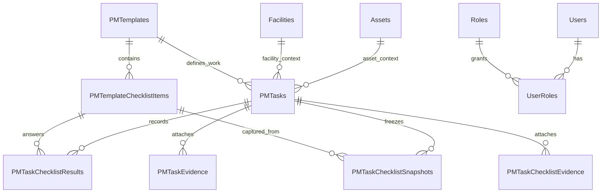

# Database Schema Specification

Last reviewed: 2026-09-10. Baseline: static inspection of [db/schema.sql](../db/schema.sql); no database connection was made for D0.

## Authority and evolution

This document owns the data-model explanation. The executable DDL is `db/schema.sql`; maintain both together. The script contains initial creation and subsequent conditional alterations, so reading only a `CREATE TABLE` block can give an incorrect final column definition. For example, `PMTasks.AssetId` is subsequently made nullable to support facilities.

The database engine is Microsoft SQL Server and the application schema is `pm`. Most entity identifiers use `uniqueidentifier`; maintenance timestamps use `datetime2`, commonly with `sysutcdatetime()` defaults. Applications must interpret stored timestamps consistently as UTC and present local time deliberately.

## Entity inventory

All names below belong to the `pm` schema. This inventory lists every `CREATE TABLE` entry in the current DDL; it does not replace column-level SQL definitions.

| Area | Tables | Responsibility |
| --- | --- | --- |
| Schema tracking | `SchemaInfo` | Applied schema metadata |
| Identity | `Roles`, `Users`, `UserRoles`, `UserCredentials` | User identity, role membership, and local credentials |
| Asset catalog | `AssetCategories`, `Locations`, `Assets` | Synchronized asset context, raw/normalized status, and image data |
| Facilities | `Facilities` | Locally managed non-asset maintenance contexts |
| PM defaults | `AssetPMSettings`, `FacilityPMSettings` | PM enabled state, default template, completion metadata, and durable planned/effective next-due anchors |
| Templates | `PMTemplates`, `PMTemplateChecklistItems` | Interval/category/role/duration and ordered checklist definitions |
| Planning | `AssignmentRules`, `BlackoutWindows`, `PMSchedules`, `FacilityPMSchedules` | Assignment selection, exclusions, recurring schedules, and freeze state |
| Execution | `PMTasks`, `TaskWorkSessions`, `CMDowntimeIntervals`, `CMTaskEvents`, `PMTaskChecklistResults`, `PMTaskChecklistSnapshots`, `TaskDrafts`, `PMMissedOccurrences`, `PMSkippedOccurrences` | Shared PM/CM work, additive PM active-time intervals, additive CM downtime/history intervals, submitted checklist results, frozen PM checklist definitions, user drafts, and recurrence history for missed/skipped planned occurrences |
| Evidence | `PMTaskEvidence`, `PMTaskChecklistEvidence` | Task/checklist attachment metadata and storage references |
| Notifications | `NotificationChannels`, `NotificationRules`, `NotificationLog` | Routing configuration, triggers, and delivery records |
| Audit/operations | `AuditLog`, `SystemLog`, `SnipeSyncRuns` | Action history, operational events, and sync runs |
| Settings | `SystemSettings`, `SnipeItSettings`, `MicrosoftGraphSettings` | Application and integration configuration |
| Mobile | `Devices`, `AppInstallations` | Push registration and installed application reporting |

## Relationships

```mermaid
erDiagram
  Assets ||--o{ PMTasks : asset_context
  Facilities ||--o{ PMTasks : facility_context
  PMTemplates ||--o{ PMTasks : defines_work
  PMTemplates ||--o{ PMTemplateChecklistItems : contains
  PMTasks ||--o{ PMTaskChecklistResults : records
  PMTasks ||--o{ PMTaskChecklistSnapshots : freezes
  PMTasks ||--o{ PMTaskEvidence : attaches
  PMTasks ||--o{ PMTaskChecklistEvidence : attaches
  PMTemplateChecklistItems ||--o{ PMTaskChecklistResults : answers
  PMTemplateChecklistItems ||--o{ PMTaskChecklistSnapshots : captured_from
  Users ||--o{ UserRoles : has
  Roles ||--o{ UserRoles : grants
```

The diagram is conceptual and omits many foreign keys. Each task has an asset **or** a facility, never both. The two diagram edges do not imply both contexts are populated.

## Task model and invariants

- `PMTasks` is the shared work entity; `MaintenanceType` is constrained to `PM` or `CM`. There is no separate top-level WorkOrders table.
- `TaskId` is the primary key; `TaskNumber` is unique.
- `CK_pm_PMTasks_AssetOrFacility` enforces exclusive context.
- Filtered unique indexes cover `(AssetId, TemplateId, ScheduledDueAt)` and `(FacilityId, TemplateId, ScheduledDueAt)` for non-null contexts. SC-01 also adds filtered unique indexes on `(AssetId, TemplateId, PlannedDueAt)` and `(FacilityId, TemplateId, PlannedDueAt)` so one planned PM occurrence cannot be represented by multiple open task rows for the same context/template.
- Lifecycle `Status` and `ApprovalStatus` have distinct meanings. Approval values include `None`, `PendingSupervisor`, `PendingSuperadmin`, `Approved`, and `Rejected`.
- Technician, supervisor, superadmin, rejection, completion, cancellation, and backdating fields preserve different events; do not collapse them into one timestamp.
- AF-01 uses the existing PM cancellation columns for system-driven broken-asset cancellation as well. In that path `CancelledByUserId` remains `NULL`, `CancelledReason` records the broken-asset reason, and attribution lives in `AuditLog`.
- CM fields include reported-by/at/channel, symptom, failure category/code, impact, and downtime boundaries. Check later alterations for resolution fields.
- Checklist outcomes are constrained to `0`, `1`, or `2`; evidence and draft tables are distinct from submitted results.
- `PMTaskChecklistSnapshots` is additive, keyed by task plus original `TemplateChecklistItemId`, and preserves sort order, text, requirement flags, active state, capture time, and source template version at the first successful technician submission. It does not replace submitted results/evidence rows; those continue to identify checklist items by `TemplateChecklistItemId`.
- SC-01 extends recurrence tracking with `AssetPMSettings.NextPlannedPMDueAt`, `FacilityPMSettings.NextPlannedPMDueAt`, `PMTasks.PlannedDueAt`, and `PMTasks.FulfilledPlannedDueAt`. `PlannedDueAt` identifies the schedule anchor for the task's occurrence; `ScheduledDueAt` remains the effective due after blackout adjustment; `FulfilledPlannedDueAt` records which planned occurrence was actually satisfied when the task completed or was approved.
- `PMMissedOccurrences` and `PMSkippedOccurrences` retain history for planned dates that were not performed or were intentionally skipped. They preserve the planned due, effective due, optional related task, and user/reason data for skips so reporting can distinguish overdue nonperformance from intentional omission.
- EX-01 adds `PMTasks.SourceTaskId` for linked replacement PM work and PM-finding-sourced CM work, plus `PMTasks.SourceTemplateChecklistItemId` for one-finding-to-one-CM-work-order traceability. Filtered unique indexes prevent multiple replacement PM tasks for the same rejected source task and multiple CM work orders for the same failed finding pair.
- CM-01 adds `PMTasks.RecurringFromTaskId` to link a post-closure recurrence back to the previous CM work order.
- `CMDowntimeIntervals` stores additive same-WO downtime intervals with one filtered open interval per task, supporting restoration-before-closure and repeated outages without counting operational gaps as downtime.
- `CMTaskEvents` stores additive CM history entries such as `reported`, `repair_submitted`, `returned_for_correction`, `verified_closed`, `restoration_recorded`, `downtime_reopened`, and `repeat_fault_linked`.
- `TaskWorkSessions` stores additive PM execution intervals with `StartedAt`, `StartedByUserId`, optional `EndedAt`, and optional `EndedByUserId`. A filtered unique index on `(TaskId)` where `EndedAt IS NULL` ensures at most one open session per task at a time.

## Schedule calculation

SC-01 persists a durable planned anchor alongside the effective due. `AssetPMSettings` and `FacilityPMSettings` now store both `NextPlannedPMDueAt` and blackout-adjusted `NextPMDueAt`, while `PMTasks` stores `PlannedDueAt` and `ScheduledDueAt`. Schedule readers and writers must preserve the distinction: planned recurrence advances from `PlannedDueAt`, while blackout only affects the effective execution date.

The legacy SQL primitive `pm.fn_CalculateNextDueAt` still exists for older paths, but the implemented SC-01 policy uses the persisted planned/effective anchors plus missed/skipped ledgers to avoid completion-date drift. See Q-04 and Q-18 for remaining reporting/compliance boundaries when interpreting this data.

## Storage and history

Asset image binaries can be stored in SQL alongside image metadata. Evidence files use filesystem/share storage with database metadata; backing up SQL alone does not preserve all evidence. PM checklist history now depends on both submitted results/evidence and the preserved snapshot rows. Archive behavior, permanent deletion, and reference protection vary by entity and endpoint. Preserve referential meaning when changing deletion behavior.

## Applying and validating changes

Run `npm run db:apply-schema` only against the intended database after reviewing the script and configuration. Run `npm run db:verify` afterward, but do not treat it as complete model validation: its hard-coded expected-table inventory omits some newer entities and does not prove all column/index/constraint semantics.

Required D2 checks: fresh database application, repeat application, expected columns/types/nullability, all foreign keys and filtered indexes, approval values, exclusive context, and duplicate rejection. Record the target environment and results. These database checks were not performed during documentation reconstruction.

## Confirmed CM event semantics — 2026-09-11

CM-01 now distinguishes equipment restoration (downtime end), technician repair-completion submission, and Supervisor/Admin/Superadmin verification/WO closure with additive event history rather than overloading one timestamp pair. Administrative waiting does not extend equipment downtime after restoration. Correction retains the same WO identity and previous work/evidence history, with an attributable mandatory return reason. Repair-performer and reviewer identities remain stored separately so self-verification can be rejected regardless of role.

Confirmed downtime-history requirement, 2026-09-11, now implemented locally by CM-01: preserve multiple outage intervals on the same WO when the same fault recurs before closure. Sum outage durations without counting operational gaps. Recurrence after closure creates a new linked WO; preserve previous WO and interval history. Restoration defaults to current time and supports actual past time with a mandatory reason and change history. Legacy data is backfilled additively from the original single downtime start/end pair into `CMDowntimeIntervals` and `CMTaskEvents`.

## PM activation and deactivation — 2026-09-27

Q-14/Q-15 uses existing context `LocationId`, PM settings, template `IsActive`, task lifecycle fields, `TaskWorkSessions` and audit records. No DDL change is required. Disabling PM/archiving a facility updates only unstarted open PM tasks to cancelled, retaining records and actor/time/reason. Settings validation and cancellation share one transaction; see [local verification](verification-q14-q15.md).

## Manual task deletion — 2026-09-27

No schema migration is required. All 13 current foreign keys into `pm.PMTasks` are covered by `taskDeletionPolicy.ts`: eight task-owned tables are deleted before the parent; two self-reference columns (`SourceTaskId`, `RecurringFromTaskId`), missed/skipped occurrence records and notification logs block deletion. Existing audit rows remain, and a new deletion audit is inserted in the same transaction. The selected parent uses `XLOCK, HOLDLOCK`; incoming reference checks use `UPDLOCK, HOLDLOCK`. Live SQL concurrency acceptance remains separate. See [verification](verification-task-deletion.md).

## Live additive prerequisite rollout — 2026-09-27

The configured `AssetMaintDB` database lacked the EX-01/CM-01 source/recurrence columns and three work-history tables. [The scoped migration](../db/migrations/20260927-task-deletion-prerequisites.sql) copies only those additive definitions and indexes from `db/schema.sql`. It was committed in one SQL transaction with a 30-second request timeout. The initial runner supplied SET options in a separate batch; future runners must put session settings in the same batch as the migration to guarantee their scope. No operational task backfill was run. Live metadata changed from 36 to 39 tables, 62 to 73 foreign keys, and 65 to 76 indexes; `db:verify` now passes. `SchemaInfo` remains version 6: this limited migration does not claim a full-schema rollout or CM historical backfill.

## D2 schema readiness — 2026-09-27

Creation order now places PMTemplates before FacilityPMSettings and MaintenanceType before filtered planned-occurrence indexes. Guarded upgrades restore the task facility FK and exclusive-context check for older databases. A disposable clean/repeat/upgrade test passed; the two missing constraints were added WITH CHECK to the live database after verifying zero violations. The verifier now covers source object inventory and column shapes/flags with explicit definition-level limits. See [evidence](verification-d2-environment.md).

## PMOccurrenceResolutions — 2026-10-06

`PMOccurrenceResolutions` (`pm.PMOccurrenceResolutions`) is an additive execution-to-occurrence ledger. OriginalTaskId is the primary key and references PMTasks; unique FulfilledByTaskId references the actual PM execution. PlannedDueAt and EffectiveDueAt retain canonical cadence/execution deadlines; Reason and RecordedAt explain the authorized reconciliation. Distinct-task check prevents self-links. No checklist, evidence, approval or missed-history record is removed. See `db/migrations/20261006-pm-occurrence-resolutions.sql`. Runtime data migration requires a protected before-image, transaction, concurrency rechecks and audit entries; initial schema deployment is independent of data reconciliation.

Automatic PM retirement uses existing PMTasks cancellation fields and AuditLog; no migration is required. `PM_AUTO_SUPERSEDED:<active-task-uuid>` retains the ongoing execution reference, while `PM_AUTO_MISSED:` indicates an unperformed occurrence preserved in PMMissedOccurrences. These are cancellation records, never PMOccurrenceResolutions or completed executions. Deletion and reopening are blocked for automatic retirement history and referenced active tasks. Transaction-owned context application locks serialize creation, start/resume and generation.

The generator may restore an untouched automatically superseded future occurrence when it becomes the current need and no protected execution remains. It reuses the same task ID to respect unique occurrence indexes, retains the previous cancellation reason in an audit event, and never restores missed, skipped, manually cancelled or worked records. User-facing reopen remains blocked for automatic history. Evidence writes fence the task row; draft writes share the context lock and recheck editable status.

Reviewed legacy ongoing PM Now may carry its canonical period in existing FulfilledPlannedDueAt without a CompletedAt value; this field is a period reference, not proof of completion. Raw PlannedDueAt and ScheduledDueAt remain immutable where existing unique indexes include cancelled original tasks. Finalization uses the period reference first. Calendar joins the corresponding automatically superseded original to obtain its effective scheduled date. Approved reconciliations still use PMOccurrenceResolutions.
