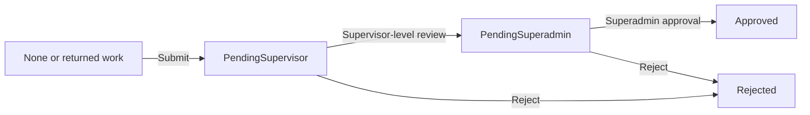

# Functional Specification

Last reviewed: 2026-09-10. Baseline: observed source and reconciled product intent. Runtime acceptance remains open.

## Current delivery scope

The current priority is the desktop/browser application and its backend/database. Mobile-specific work and acceptance are deferred; retained mobile descriptions provide context and do not create desktop release gates. Follow the [desktop-first roadmap](implementation-roadmap.md) for the scoped checklist.

## Actors and terminology

Technician, Supervisor, Admin, and Superadmin are the main role names. Assignment may target a user or a role. See [security and access](security-and-access-model.md) for endpoint-specific distinctions.

An **asset** is synchronized equipment. A **facility** is a locally maintained non-asset area. A **template** defines recurring PM and checklist requirements. A **PM task** is preventive work. A **CM work order** is reactive work stored in the same task entity with `MaintenanceType = CM`. Each task references exactly one asset or facility.

## F-01 — Assets and facilities

Assets support search, filters, detail, maintenance settings, history, images, and PM Now. Snipe-IT sync preserves its raw status label and a normalized operational status (`operational`, `broken`, `archived`). Assets missing from sync are archived to retain history.

Facilities support creation, editing, archive, cloning, and PM defaults, including bulk PM operations. They are not Snipe-IT hardware records.

Acceptance: maintenance settings persist for the selected context; history retains task/evidence relationships; archived/broken state is reflected in scheduling behavior.

## F-02 — Templates and checklists

Templates define intervals, applicable category, required assignment role, estimated duration, and ordered checklist items. Attachment enablement controls whether an attachment is offered; attachment requirement controls completion validation. Required items cannot be skipped. Outcomes use `0 = skip`, `1 = pass`, `2 = fail` for pass/fail checklist items; non-pass/fail items display nonzero completion as done.

Completion handlers validate applicable checklist, notes, and evidence rules. Do not assume that submission applies identical validation: Q-02 remains open. Unused template deletion and references must be checked against the route rather than assuming all deletions are soft deletes.

Acceptance: ordering survives save/reload; applicable category restrictions hold; required evidence/notes failures are rejected and explained.

## F-03 — Scheduling and assignment

Recurring schedules exist for assets and facilities. The background job calculates upcoming work within its configured horizon. PM Now can create immediate work and includes idempotency checks. Assignment rules can fall back to the template's required role.

Broken/archived assets and frozen schedule rows are excluded from applicable new-task generation. Existing tasks remain visible. Calendar/day responses can include projected occurrences that are not yet persisted tasks. Estimated duration uses the template value with a 60-minute fallback; the web capacity display uses an eight-hour default threshold. This is a planning display, not proof of per-technician staffing optimization.

`pm.fn_CalculateNextDueAt` is used in scheduling paths. Approval still contains separate next-due logic, so universal calculation parity is not established (Q-04).

Acceptance: test duplicate requests, frozen rows, broken assets, blackouts, interval boundaries, asset/facility parity, and the distinction between actual and projected work.

## F-04 — Task execution and evidence

Task APIs expose start, pause, resume, cancel, reopen, complete, assignment, draft, evidence, and export operations. Stored lifecycle values and UI filters must not be treated as one enum: due-today/overdue/upcoming labels may be derived from dates and state.

Evidence supports task-level and checklist-level attachments. Storage is configured server-side; the existing convention uses quarter/year folders. The documented upload limit is 50 MB per file. Access and approval locks must be enforced server-side. Backdated completion is restricted to management roles and requires a non-future timestamp and a reason; effective completion time and data-entry time remain separate.

Acceptance: successful execution persists results and evidence; missing/invalid data, forbidden ownership, approval locks, oversized files, and future backdates fail appropriately. Verify upload limits and formats against each operation rather than assuming generic multipart behavior.

## F-05 — PM approval

Expected review path:

Revision is a separate action and can reopen work; its exact reset behavior must be read together with the endpoint contract. The overview above is not a complete transition validator.

| Operation | Observed behavior |
| --- | --- |
| `complete` | Sets lifecycle completion fields after validation; not equivalent to final approval |
| `submit-for-approval` | Writes technician trail and `PendingSupervisor`; the handler does not itself set lifecycle `Status = completed` |
| `approve-by-supervisor` | Requires `PendingSupervisor`; allows Supervisor, Admin, or Superadmin; moves to `PendingSuperadmin` |
| `approve-by-superadmin` | Requires `PendingSuperadmin`; Superadmin only; sets `Approved` and lifecycle completion |
| `revise-approval` | Separate correction path with Supervisor/Superadmin route guard |
| `reject-approval` | Records rejection metadata; verify reopening and transition details per route |

The web Approvals page provides review queues. Task detail and PDF export expose sign-off information. Historical statements that submission always marks lifecycle completion are superseded by this distinction. Checklist validation at submission, segregation of duties, and facility finalization require D1 verification (Q-02–Q-04).

Acceptance: test each actor and valid/invalid transition, repeated submission, required evidence, returned work, own-work approval policy, and facility/asset finalization. Do not count source inspection as acceptance.

## F-06 — Corrective maintenance

Create a work order from an asset/facility breakdown or a PM finding. Collect symptom, impact, optional failure category/code, reported channel, and downtime start. CM reuses task/checklist/evidence infrastructure through `/api/work-orders` and shared task operations where applicable.

Work orders support list/detail, assignment, start/pause/resume, complete, cancel, closing downtime, and resolution updates. The web provides a ticket-style subject and resolution view. Do not assume PM approval is automatically required for CM.

Acceptance: a breakdown remains associated with exactly one context; assignment and lifecycle access are enforced; closing downtime and completing work have distinguishable effects; PM views exclude CM where required.

## F-07 — Reports and notifications

Reports cover compliance, overdue work, assets without PM, and system logs. CM metrics include incident counts, grouping by category/location/failure/impact, and reported-to-complete MTTR. CSV exports and task PDF exports are available in the existing implementation. Approval inclusion and date denominators need verification before using these as audited KPIs (Q-09).

Notification configuration supports mail/Microsoft Graph, WhatsApp, and push. Rules cover reminders/escalations and task/approval events. Admin/Superadmin broadcast is a separate action. See [integration contracts](integration-contracts.md) for routing and delivery limitations.

## F-08 — Mobile

The available client is `mobile/pm-tech`: React + Vite + Capacitor, not React Native. It includes PM tasks, CM work orders, assets/facilities, schedule, offline, and profile pages, plus native QR/biometric/push/update integrations.

Production API fallback is a fixed HTTPS domain in the client. Discovery is opt-in. Offline replay, native installation, and biometric storage guarantees require device testing. Mobile is currently ignored by Git; local presence is not fresh-checkout availability (Q-06).

## Traceability

Source evidence: `src/pages`, `src/lib/api.ts`, `backend/src/routes`, `backend/src/jobs`, `db/schema.sql`, and the available `mobile/pm-tech` source. Contract gaps are in [API coverage](api-coverage.md). Verification scenarios and phase gates are in [testing strategy](testing-strategy.md) and the [roadmap](implementation-roadmap.md).
