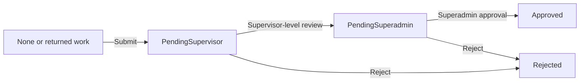

# Functional Specification

Last reviewed: 2026-09-10. Baseline: observed source and reconciled product intent. Runtime acceptance remains open.

## Current delivery scope

The current priority is the desktop/browser application and its backend/database. Mobile-specific work and acceptance are deferred; retained mobile descriptions provide context and do not create desktop release gates. Follow the [desktop-first roadmap](implementation-roadmap.md) for the scoped checklist.

## Actors and terminology

Technician, Supervisor, Admin, and Superadmin are the main role names. Assignment may target a user or a role. See [security and access](security-and-access-model.md) for endpoint-specific distinctions.

An **asset** is synchronized equipment. A **facility** is a locally maintained maintenance context, including areas and server-specific UPS equipment under the user-confirmed scope. A **template** defines recurring PM and checklist requirements. A **PM task** is preventive work. A **CM work order** is reactive work stored in the same task entity with `MaintenanceType = CM`. Each task references exactly one asset or facility.

## F-01 — Assets and facilities

Assets support search, filters, detail, maintenance settings, history, images, and PM Now. Snipe-IT sync preserves its raw status label and a normalized operational status (`operational`, `broken`, `archived`). Assets missing from sync are archived to retain history.

Facilities support creation, editing, archive, cloning, and PM defaults, including bulk PM operations. They are not Snipe-IT hardware records.

Acceptance: maintenance settings persist for the selected context; history retains task/evidence relationships; archived/broken state is reflected in scheduling behavior.

### User-confirmed scope — 2026-09-11

Snipe-IT is the sole asset master source: create new assets there, then synchronize. PM is passive for synchronized asset master data while owning maintenance configuration and records. AC and electrical panels are excluded from the current maintenance scope; server-specific UPS is classified as a facility. Current sync imports returned Snipe-IT hardware without a special AC/panel filter; this inspection does not establish which categories are present upstream. No sync-filter change is authorized by the maintenance-scope exclusion alone.

Location represents the site and is not expected to change in normal operations. Admin/Superadmin own facility master-data changes; Supervisors communicate needs verbally and cannot create/edit/archive facilities. No in-app facility change-request workflow is required. Closure behavior remains open. Broken assets now receive no new PM work, and unfinished PM asset tasks are automatically cancelled with history retained. AF-01 cancels all unfinished PM asset tasks, including approval-pending submissions, when Snipe-IT synchronization marks the asset `broken`; completed/cancelled history and CM work orders are untouched. PM Now and PM lifecycle actions that would make the task actionable again are rejected while the asset remains broken, and repeated sync/action retries are idempotent. Automatic archival of missing upstream assets does not require admin confirmation; upstream reappearance does not reopen previously cancelled PM tasks automatically.

Asset-to-facility mapping is only a possible future capability. No additional prerequisite fields were requested, but exact mandatory-field and exclusion rules remain undecided. The primary daily desktop needs are schedules and PM tasks. See the [answer evaluation](implementation-roadmap.md) for confirmed versus tentative decisions; implementation parity has not yet been tested.

## F-02 — Templates and checklists

Templates define intervals, applicable category, required assignment role, estimated duration, and ordered checklist items. Attachment enablement controls whether an attachment is offered; attachment requirement controls completion validation. Required items cannot be skipped. Outcomes use `0 = skip`, `1 = pass`, `2 = fail` for pass/fail checklist items; non-pass/fail items display nonzero completion as done.

PM completion and technician submission now share the same checklist-validation baseline for active item membership, mandatory non-skip outcomes, fail notes, explicit notes-on-pass/done flags, and attachment requirements. Submission still does not set lifecycle `Status = completed`; the completion-versus-submission state boundary remains Q-02. Unused template deletion and references must be checked against the route rather than assuming all deletions are soft deletes.

Acceptance: ordering survives save/reload; applicable category restrictions hold; required evidence/notes failures are rejected and explained.

### User decisions — 2026-09-11

Template management remains available to Supervisor/Admin/Superadmin. Notes are required on failure rather than merely because an item is mandatory. For checklist items explicitly configured with `RequiresNotes`, notes are also required on Pass/Done. Existing per-item attachment rules remain unchanged.

Nonfinal tasks follow template changes, while final-submitted/historical tasks retain their original checklist definitions. The cutoff is successful technician submission for approval (`submit-for-approval`, entering `PendingSupervisor`), not final Superadmin approval. TC-02 now preserves an additive per-task checklist snapshot at the first successful submission and reuses it for later review, revision/resubmission, task detail, checklist progress counts, evidence labeling, and PDF/history export. Returned/reopened work keeps the original submitted definition; later template edits must not silently replace it. Legacy historical tasks that predate the snapshot model fall back to the current template, but the API/export must make that uncertainty explicit rather than claiming the live definition is the original historical one. Use [TC-02](implementation-roadmap.md#tc-02) as the action reference.

## F-03 — Scheduling and assignment

Recurring schedules exist for assets and facilities. The background job calculates upcoming work within its configured horizon. PM Now can create immediate work and includes idempotency checks. Assignment rules can fall back to the template's required role.

Broken/archived assets and frozen schedule rows are excluded from applicable new-task generation. AF-01 also rechecks asset availability at PM Now creation time and at the schedule-insert boundary so a stale candidate cannot recreate actionable PM work after the asset has already become broken. Existing tasks remain visible. Calendar/day responses can include projected occurrences that are not yet persisted tasks. Estimated duration uses the template value with a 60-minute fallback; the web capacity display uses an eight-hour default threshold. This is a planning display, not proof of per-technician staffing optimization.

`pm.fn_CalculateNextDueAt` is used in scheduling paths. Approval still contains separate next-due logic, so universal calculation parity is not established (Q-04).

Acceptance: test duplicate requests, frozen rows, broken assets, blackouts, interval boundaries, asset/facility parity, and the distinction between actual and projected work.

### Confirmed scheduling policy — 2026-09-11

Use one default template per asset/facility. Recurring PM remains anchored to planned due dates: monthly work due 1 September and completed 10 September is next due 1 October. Completion or approval delays must not shift the planned cadence. SC-01 now persists this with separate planned and effective due dates so approval/completion delays do not move the regular anchor.

Retain the existing first-date fallback (current time plus template interval when no date/history exists), 30-day default generation horizon, and Supervisor/Admin/Superadmin planning permissions. See [SC-01](implementation-roadmap.md#sc-01) for implementation and verification. Missed-period and PM Now behavior is defined below. Blackout/manual changes and technical/migration boundaries still require scoped reconciliation before dependent changes.

### Missed periods, early PM, and PM Now — agreed 2026-09-11

Maintain one actionable PM job for the current maintenance need rather than requiring several repeated checklists for one physical execution. Preserve missed periods as not performed, never implicitly completed. Do not automatically replace in-progress or approval-stage work. For work caught up in November, preserve September/October misses and keep the next planned date at 1 December.

Early execution fulfills the next regular occurrence: performing a 1 October task on 20 September leaves 1 November as the next planned date. Preserve the original planned date and actual execution date separately.

For the same asset/facility and template, PM Now reuses applicable due/overdue work first, then an existing next regular task. If no applicable task exists, create a task representing the next regular occurrence and prevent duplicate generation. SC-01 now applies this reuse order for asset and facility PM Now flows and keeps missed periods recorded separately as not performed.

### Blackout and Skip next PM — 2026-09-11

Retain existing global blackout behavior; no blackout expansion or separate indefinite suspension workflow is requested. Skip next PM intentionally omits one upcoming occurrence and leaves PM enabled on its original cadence. Supervisor, Admin, and Superadmin may perform it with a required reason. Preserve the occurrence, actor/time, and any existing task history; do not record the skip as completed work or automatically replace in-progress/approval-stage tasks.

Example: skipping 1 October leaves 1 November as the next regular occurrence. A deliberately skipped occurrence must be distinguishable from ordinary overdue nonperformance. SC-01 now records the skipped occurrence with reason, actor and time, cancels an unstarted generated task for that planned occurrence when necessary, and advances only one planned cycle. Current reporting continues to use the effective due window (`ScheduledDueAt`) and keeps skip history distinguishable for later policy refinement. Skip privileges do not broaden existing blackout-administration privileges.

### Role queue and capacity — agreed 2026-09-11

Routine PM work is routed to an appropriate role queue using assignment rules/template-role fallback. An eligible technician claims the task and becomes its single responsible person. Claims must be exclusive under concurrency; role membership does not permit takeover of a task already assigned to another technician. Managers retain direct assignment/reassignment for operational exceptions, and existing individual assignments must not be silently cleared.

AS-01 now implements this with an atomic `POST /api/tasks/{taskId}/claim` flow for PM tasks that are still queued to a role, plus ownership precedence of assigned user over role membership across execution and shared work-order/task mutation paths. Repeating the claim by the current owner is idempotent and returns `claimed=false`; another technician receives a conflict instead of silently taking over.

Supervisor/Admin/Superadmin may reassign before technician submission, including while work is in progress. After submission, reassignment is locked until the Supervisor explicitly returns the work for revision. Submitted PM tasks are also locked from technician claim and non-Superadmin draft editing while pending approval or already approved. Preserve actor/result/evidence history across a handoff; returning for revision does not implicitly change the submitted checklist definition.

Assignment-rule editing remains Superadmin-only. Keep the current aggregate estimated workload per day; no per-technician capacity, shift management, or automatic balancing is requested. Task-list "assigned to me" and outstanding-count semantics only match a role queue when the task does not yet have an individual assignee. See [AS-01](implementation-roadmap.md#as-01) and [verification evidence](verification-as01.md) for the implemented behavior and local verification scope.

## F-04 — Task execution and evidence

Task APIs expose start, pause, resume, cancel, reopen, complete, assignment, draft, evidence, and export operations. Stored lifecycle values and UI filters must not be treated as one enum: due-today/overdue/upcoming labels may be derived from dates and state.

Evidence supports task-level and checklist-level attachments. Storage is configured server-side; the existing convention uses quarter/year folders. The documented upload limit is 50 MB per file. Access and approval locks must be enforced server-side. Backdated completion is restricted to management roles and requires a non-future timestamp and a reason; effective completion time and data-entry time remain separate.

Acceptance: successful execution persists results and evidence; missing/invalid data, forbidden ownership, approval locks, oversized files, and future backdates fail appropriately. Verify upload limits and formats against each operation rather than assuming generic multipart behavior.

### Execution decisions — 2026-09-11

Support Start/Pause/Resume to measure PM work time; Pause does not require a reason for now. EX-01 now persists additive PM work-session rows rather than deriving active duration from `StartedAt`/`CompletedAt` alone. Active work is distinguished from paused or approval-waiting time, and task detail exposes a `workSessionSummary` with total active seconds, session count, and the currently open session start time when applicable. Timing starts only from explicit Start/Resume, not merely from assignment or draft entry.

An inspection containing Fail may be submitted with required notes and configured evidence. Offer explicit work-order creation for the finding; this is optional, not automatic or a prerequisite to submitting the PM inspection. Repair completion is distinct from inspection submission.

## F-05 — PM approval

Expected review path:

```mermaid
flowchart LR
  N[None or returned work] -->|Submit| S[PendingSupervisor]
  S -->|Supervisor-level review| A[PendingSuperadmin]
  A -->|Superadmin approval| F[Approved]
  S -->|Reject| R[Rejected]
  A -->|Reject| R
```

Revision is a separate action and can reopen work; its exact reset behavior must be read together with the endpoint contract. The overview above is not a complete transition validator.

| Operation | Observed behavior |
| --- | --- |
| `complete` | Sets lifecycle completion fields after validation; not equivalent to final approval |
| `submit-for-approval` | Applies the PM checklist validation baseline, writes technician trail and `PendingSupervisor`; the handler does not itself set lifecycle `Status = completed` |
| `approve-by-supervisor` | Requires `PendingSupervisor`; allows Supervisor, Admin, or Superadmin; moves to `PendingSuperadmin` |
| `approve-by-superadmin` | Requires `PendingSuperadmin`; Superadmin only; sets `Approved`, lifecycle completion, and closes any open PM work session |
| `revise-approval` | Separate correction path with Supervisor/Superadmin route guard; requires a nonblank written reason and closes any open PM work session |
| `reject-approval` | Requires a nonblank written reason, preserves the rejected task history, and creates or reuses one linked replacement PM task instead of reopening the same task |

The web Approvals page provides review queues. Task detail and PDF export expose sign-off information. Historical statements that submission always marks lifecycle completion are superseded by this distinction. PM checklist validation at submission is aligned with completion. EX-01 now also closes active PM work sessions on submission and final approval so review waiting time is not counted as active execution time. Segregation of duties and facility finalization still require D1 verification (Q-02–Q-04).

Acceptance: test each actor and valid/invalid transition, repeated submission, required evidence, returned work, own-work approval policy, and facility/asset finalization. Do not count source inspection as acceptance.

### Return-to-work decisions — 2026-09-11

Revise means the existing task can be corrected and requires a written reason. Reject means the work is incorrect and must be repeated. User confirmed that repeated work uses a new replacement task linked to the rejected original. Retain original results, evidence, work time, and rejection reason. Creation trigger, duplicate prevention, assignment, template selection, and recurrence/compliance attribution remain implementation boundaries (Q-20). Preserve rejected history and the submitted checklist definition; do not silently discard prior results/evidence or treat every rejected state as a revision unlock.

See [EX-01](implementation-roadmap.md#ex-01) for implementation/verification. The implemented flow now enforces the mandatory revision/rejection reason and linked replacement-task behavior; remaining follow-up is limited to reporting/compliance interpretation rather than core workflow semantics.

## F-06 — Corrective maintenance

Create a work order from an asset/facility breakdown or a PM finding. Collect symptom, impact, optional failure category/code, reported channel, and downtime start. CM reuses task/checklist/evidence infrastructure through `/api/work-orders` and shared task operations where applicable. EX-01 now adds optional `sourceTaskId` and `sourceTemplateChecklistItemId` linkage for failed PM findings so the same finding can reuse its existing linked work order on repeated clicks. Automatic creation is still not requested.

Work orders support list/detail, assignment, start/pause/resume, technician repair submission, manager verify-close, same-WO return for correction, independent restoration logging, downtime reopening before closure, linked recurrence after closure, cancel, and resolution updates. The web provides a ticket-style subject, downtime history, review state, and event history view. Do not assume the PM approval chain applies to CM.

Confirmed user direction, 2026-09-11, now implemented locally by CM-01: the technician reports repair completion; the Supervisor verifies the repair and closes the WO. Equipment restoration ends downtime even if administrative WO closure is still pending. Restoration, technician completion, and manager closure are stored as distinct events. Incomplete repair is returned to the technician on the same WO with a mandatory written reason and preserved work/evidence history. Supervisor, Admin or Superadmin may perform the single verification and close the WO; no second approval stage is required. A repair performer must never verify their own WO, regardless of role.

Confirmed restoration and recurrence policy, 2026-09-11, now implemented locally by CM-01: the assigned technician or Supervisor/Admin/Superadmin may record equipment restoration; recording restoration does not approve or close the WO. Default to the current time, but allow an actual past restoration time with a mandatory written reason and change history. If the same fault recurs before WO closure, retain that WO and append a new downtime interval. If it recurs after closure, create a new WO linked to the previous WO. Exclude the intervening operational time from downtime; retain previous intervals. An unrelated fault is separate work.

Acceptance: a breakdown remains associated with exactly one context; assignment and lifecycle access are enforced; closing downtime and completing work have distinguishable effects; PM views exclude CM where required.

## F-07 — Reports and notifications

Reports cover compliance, overdue work, assets without PM, and system logs. CSV exports and task PDF exports are available in the existing implementation.

Current implemented metric contract, 2026-09-17:

- Compliance uses UTC `ScheduledDueAt` between the requested `from` and `to` timestamps as the denominator. Cancelled work is excluded from the denominator. `approvedOnly=true` narrows only the completion numerators (`completedOnTime`, `completedTotal`); it does not change the denominator.
- `currentlyOverdue` is evaluated at request time for the same filtered population using unfinished, uncancelled tasks whose `ScheduledDueAt` is already in the past.
- Overdue reporting also uses UTC `ScheduledDueAt` versus the request time and now includes both asset and facility task contexts. Location filters apply to either asset or facility context; category filters remain asset-only because facilities do not have asset categories.
- CM metrics use UTC `ReportedAt` between the requested `from` and `to` timestamps. MTTR is the average reported-to-completed duration (`ReportedAt` to `CompletedAt`), grouped by category/location; it is not downtime-interval duration and not technician active labor time.
- The dashboard overview is a PM overview: due today, overdue, upcoming 7 days, and compliance trend queries are PM-only and exclude cancelled tasks from those PM KPI aggregates.

Notification configuration supports mail/Microsoft Graph, WhatsApp, and push. Rules cover reminders/escalations and task/approval events. Admin/Superadmin broadcast is a separate action. See [integration contracts](integration-contracts.md) for routing and delivery limitations.

## F-08 — Mobile

The available client is `mobile/pm-tech`: React + Vite + Capacitor, not React Native. It includes PM tasks, CM work orders, assets/facilities, schedule, offline, and profile pages, plus native QR/biometric/push/update integrations.

Production API fallback is a fixed HTTPS domain in the client. Discovery is opt-in. Offline replay, native installation, and biometric storage guarantees require device testing. Mobile is currently ignored by Git; local presence is not fresh-checkout availability (Q-06).

## Traceability

Source evidence: `src/pages`, `src/lib/api.ts`, `backend/src/routes`, `backend/src/jobs`, `db/schema.sql`, and the available `mobile/pm-tech` source. Contract gaps are in [API coverage](api-coverage.md). Verification scenarios and phase gates are in [testing strategy](testing-strategy.md) and the [roadmap](implementation-roadmap.md).

## AF-02 implementation evidence — 2026-09-11

Facility creation, master edits/archival/activation and cloning now enforce Admin/Superadmin in the backend and corresponding desktop controls. Supervisor retains PM settings/PM Now rights and read access. See [AF-02 verification](verification-af02.md) for route, browser and static/build evidence and its database/deployment limits. No facility lifecycle or task-cancellation behavior was added by this permission change.
