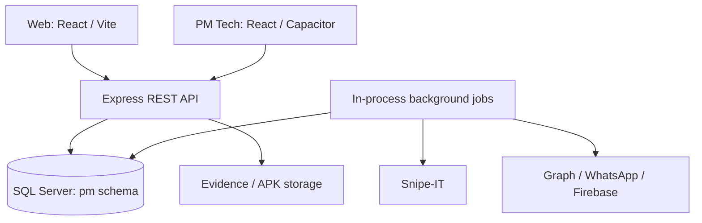

# Technical Implementation Plan

Last reviewed: 2026-09-10. This describes the existing architecture and controlled follow-up work, not a greenfield rewrite.

## Current delivery scope

The current priority is the desktop/browser application and its backend/database. Mobile-specific work and acceptance are deferred; retained mobile descriptions provide context and do not create desktop release gates. Follow the [desktop-first roadmap](implementation-roadmap.md) for the scoped checklist.

## Architecture

Docker serves the web bundle through Nginx and proxies `/api/` to the backend. SQL Server is external to the supplied root Compose stack. Jobs start in the API process.

## Repository boundaries

| Area | Implementation |
| --- | --- |
| Web | `src/pages`, `src/components`, `src/lib/api.ts`, React Query, shadcn-ui, Tailwind |
| Backend entry and embedded contract | `backend/src/index.ts` |
| HTTP validation and operations | `backend/src/routes`, Zod and Express |
| Authentication and roles | `backend/src/auth`, `backend/src/middleware`, `backend/src/db/users.ts` |
| SQL access | `mssql`, `backend/src/db/mssql.ts`, SQL inside routes/jobs |
| Scheduling and integration jobs | `backend/src/jobs` |
| Schema evolution | `db/schema.sql`, `scripts/db` |
| Mobile client | Local `mobile/pm-tech`; see Q-06 before relying on checkout availability |
| Deployment | Root/backend Dockerfiles, Compose overlays, and `nginx/default.conf` |

There is no Prisma/Sequelize layer in the inspected backend. The data-access module is not a complete repository abstraction: routes and jobs contain substantial SQL.

## Runtime configuration

Backend configuration is parsed at startup from environment variables, with a default `.env` path resolved one directory above the backend working directory. Run backend commands through the documented package scripts. Web/mobile `VITE_*` values are build-time client configuration and must not contain secrets.

See [deployment and environment](deployment-and-environment.md) for prerequisites, required variables, ports, and installation order.

## API contract maintenance

The canonical versioned documentation artifact is [openapi.yaml](openapi.yaml). Its initial content is exported from the embedded `openApiSpec` in `backend/src/index.ts`, with a relative server URL to avoid a fixed development port. Runtime Swagger still serves the embedded definition. This duplication is explicit and guarded by a parity check.

An exported contract can be incomplete even if it matches runtime Swagger. [API coverage](api-coverage.md) records route operations missing from the embedded contract; Q-01 tracks reconciliation. Do not fabricate request/response schemas for uncovered routes.

When changing an endpoint, review the documentation contract first, update the runtime definition and route together, refresh the snapshot and coverage, and check parity. Snapshot generation must not import/start the backend or read credentials.

## Data and scheduling

Maintain documented entity semantics and executable SQL together. Apply the whole schema script, including later `ALTER` statements; initial `CREATE TABLE` blocks do not represent the final schema alone. PM/CM share `pm.PMTasks` with exclusive asset/facility context.

Scheduling uses SQL date calculation and background generation, with additional calculations in some completion/approval paths. D1 must establish parity before claiming a single calculation implementation. Database uniqueness and application idempotency checks solve different parts of duplicate prevention.

## Implementation sequence

1. Identify the active [roadmap](implementation-roadmap.md) phase and relevant functional requirement.
2. Resolve documented conflicts or record a bounded open question before behavior changes.
3. Update workflow/API/schema documentation for the proposed change.
4. Implement the scoped change across affected backend, web, and mobile consumers.
5. Run appropriate static, contract, database, and workflow checks.
6. Attach evidence, synchronize documentation, and update the roadmap.

D0 modifies documentation and documentation tooling only. D1–D3 remain proposed until their scope and open decisions are addressed.

## Technical risks to resolve

- Embedded API documentation does not automatically cover every route or authorization rule.
- SQL schema verification uses a partial expected-table list.
- Multiple API replicas may execute the same in-process jobs; distributed coordination has not been verified.
- Mobile source is outside the tracked baseline in this checkout.
- Mobile token persistence and approval validation differ from some historical promises.
- Root `tsconfig.json` is a references-only configuration; `tsc --noEmit` against it alone is not proof that application files were checked.

Follow [testing strategy](testing-strategy.md) and [open questions](open-questions-and-challenges.md) for verification and decisions.
